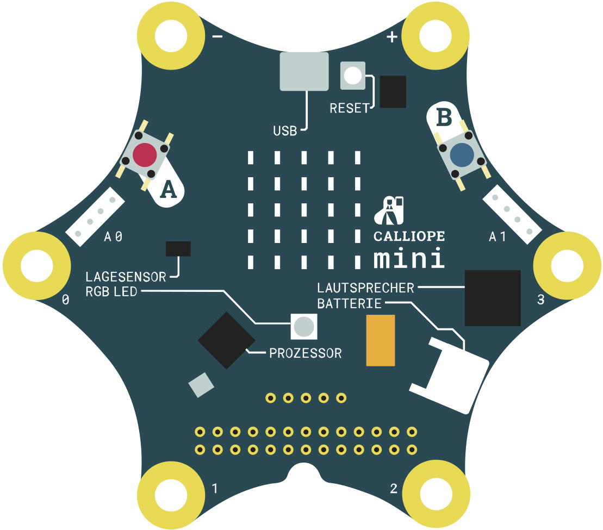

# Calliope mini Demo (and Board Test)

Calliope mini Demo.

This repository contains the demo code and the board test code. The board test is only shown after initially 
flashing the device. Any subsequent reset or power cycle will not show it again.

## Test Code

- LED matrix full on, dimming down, and back up
- check reading the accelerometer (final checkmark)
- RGB led colors (red, green, blue)
- Triple beep
- If further testing is required the board can be tilted and turned to show:
    - `+` face up, `-` down
    - `L` tilted left, `R` right, `U` up, `D` down
    - `S` shaked, `2` 2G, `8` 8G, `F` free fall
    - `0`-`3`, `A`, `B`, `A+B` touch pins and buttons
    
## Demonstration code

- An Intro is shown (may be skipped using long `A+B` click).
- Menu: 1-4
     - 1: Oracle (shows a smiley or sadly on button press)
     - 2: Rock, Paper, Scissors, Well
     - 3: Love Meter (touch P1 and P2 to show value, errata: it's P0 and P3 in the booklet)
     - 4: Snake (adaped snake code from the [microbit-samples](https://github.com/lancaster-university/microbit-samples/))

Clicking `A+B` should reset back to the menu selection.     

## Pin naming and positions



* `0` - `3` - edge connectors P0 - P3
* Connector Double Row (IO)
    * `C1` - `C15` - GPIO pins
    * `C16` / `C17` - UART RX / TX
    * `C18` / `C19` - I²C - SCL / SDA

```
V  1  3  5  7  9  G 11 13 15 17 19  G
o  o  o  o  o  o  o  o  o  o  o  o  o
o  o  o  o  o  o  o  o  o  o  o  o  o
G  0  2  4  6  8  G 10 12 14 16 18  V
```
    
* Single Connector Row (Motor)
    * `V` - VCC
    * `G` - GND
    * `1` / `2` Motor pins
    * `VM` external power 

 ```
 G  2  1  G  VM
 o  o  o  o  o 
 ```

(c) 2016 Calliope gGmbH

Licensed under the Apache Software License 2.0, see LICENE.

